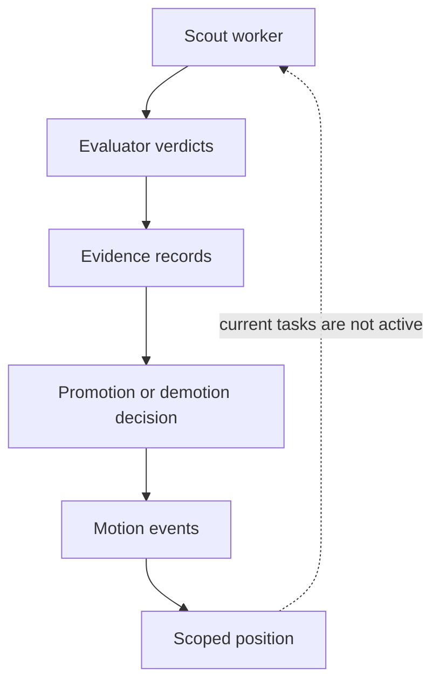

# PAA in Scout: a three-minute evidence tour

This page shows how Scout integrates the
[Progressive Autonomy Architecture](https://www.paa.dev) (PAA) and what the
checked-in evidence proves. It needs no checkout, installation, Discord
access, database, or model API key. Every link points at a file in this
repository, and every captured output is labeled.

Labels used on this page:

- **Reference execution** — real `scout paa` output, run against the
  checked-in declarations and reference artifacts in a throwaway database,
  with fixture ids and timestamps.
- **Reference evidence** — the checked-in, redacted evidence tree, rendered
  from a seeded fixture database through Scout's real evidence code paths.
- **Production-derived, redacted evidence** — output of the same audit and
  bundle tooling over a deployment's real database. It stays in that
  deployment and is not checked in here.

## The application boundary

Scout monitors Discord, Farcaster, and Bluesky for posts relevant to a set of
projects, evaluates each candidate against a versioned project dossier,
drafts an engagement comment, critiques and optionally revises it, and
presents the result to an operator in a digest and a web UI. Outbound content
creation and publishing are outside Scout; they live in a separate
application. Scout embeds the `paa-runtime` control plane as a pinned
dependency rather than implementing its own, and its tests validate the
checked-in declarations against the published `paa-contracts` schemas.

## The declared tasks

Scout checks in exactly two PAA task declarations:

- [`contracts/paa/inbound_reply_surfacing.v1.yaml`](../contracts/paa/inbound_reply_surfacing.v1.yaml)
  — admit an evaluated inbound reply candidate into the surfaced-event and
  operator-digest flow.
- [`contracts/paa/canonical_promotion.v1.yaml`](../contracts/paa/canonical_promotion.v1.yaml)
  — approve a candidate observation for inclusion in a versioned canonical
  dossier.

| Task | Initial position | Deployment | Runtime enforcement |
| --- | --- | --- | --- |
| `inbound_reply_surfacing` | `hitl` | `shadow` | Not wired to an enforcement point |
| `canonical_promotion` | `hitl` | `disabled` | Not wired to an enforcement point |

Each declaration names its evaluators as exact identity tuples (property,
target, technique, evaluation basis, epistemic status, version, authority).
[`src/scout/paa/registry.py`](../src/scout/paa/registry.py) binds every tuple
to the Scout code that produces that verdict, and
[`tests/test_paa_declarations.py`](../tests/test_paa_declarations.py) proves
both files conform to the published `paa-contracts` schema.

## The control-plane path

The dashed return edge is the intended enforcement relationship: a resolved
position is meant to gate what the worker may do. It is not behavior active
in Scout today. Both checked-in tasks are `shadow` or `disabled`, so a
position change records operator intent and event history without altering
runtime behavior.

An autonomy change is a **motion** made of append-only events:

1. `motion_proposed` binds a task, declaration version, scope, the
   transition, and the sha256 of one evidence file. Position is unchanged.
2. `motion_approved` or `motion_rejected` records a second operator's
   decision. Rejection is terminal.
3. `position_changed` is inserted together with `motion_approved`, inside
   one write transaction, so authorization and effect commit together or not
   at all.

Current position is never stored. It is folded on every read from the
declaration's `initial_position` and the latest `position_changed` event
whose (task, declaration version, scope) triple matches exactly. Two scopes
under one task never share authority, and a declaration version bump resets
the task to its new `initial_position`. Neither checked-in declaration lists
scopes, so both resolve under the null scope.

Reference execution, from an empty database to an executed promotion:

- [Initial position](assets/paa-walkthrough/01-initial-position.txt) — `hitl`
  folded from zero events.
- [Promotion proposal](assets/paa-walkthrough/02-promotion-proposal.txt) —
  one `motion_proposed` event; position still `hitl`.
- [Approved motion and resulting position](assets/paa-walkthrough/03-approved-motion-and-hotl-position.txt)
  — `motion_approved` and `position_changed` together; position now `hotl`.
- [Motion history](assets/paa-walkthrough/06-motion-history.txt) — status
  projected from events, never stored.

## The evidence path

Reference evidence lives under
[`evidence/paa/reference/`](../evidence/paa/reference/). Start with
[`reference-manifest.json`](../evidence/paa/reference/reference-manifest.json),
which records the sha256 of every artifact, the sources that produced them,
and the schema and distribution versions in force.

- [Redacted evidence bundle](../evidence/paa/reference/bundle/) — a
  schema-2 Phase 1 exit bundle with its own
  [`bundle-manifest.json`](../evidence/paa/reference/bundle/bundle-manifest.json)
  and [`redactions.json`](../evidence/paa/reference/bundle/redactions.json).
- [Audit output](../evidence/paa/reference/bundle/audit.md) — the Phase 1
  audit report, the `phase1_audit` promotion report the
  `inbound_reply_surfacing` declaration names; the canonical JSON form is
  [`audit.json`](../evidence/paa/reference/bundle/audit.json).
- [Grading schema](../evidence/paa/reference/grading_schema.json) — the
  human-grade contract the `human` evaluators are versioned against.
- [Correction and prompt example](../evidence/paa/reference/correction-and-prompt.json)
  — one operator correction and one prompt override, with their
  [redaction record](../evidence/paa/reference/correction-and-prompt.redactions.json).
- [Replay experiment summary](../evidence/paa/reference/experiment-summary.json)
  — replay output for one hermetic fixture batch, with its
  [redaction record](../evidence/paa/reference/experiment-summary.redactions.json).

Three properties hold across the tree:

- **Content addressing.** The manifest and the bundle manifest name every
  artifact by sha256. At runtime, motion evidence is stored at
  `evidence/paa/<sha256>/evidence.json`, and every autonomy event records
  both the reference and the hash it was assessed under.
- **Redaction.** Each stripped field is replaced by its sha256 and length,
  so the shape of the evidence is auditable without the content.
  [`tests/test_paa_reference_evidence.py`](../tests/test_paa_reference_evidence.py)
  seeds a sentinel for every prohibited data class and proves none survives.
- **CI drift checking.** CI re-renders the tree from the manifest's recorded
  inputs under a temporary directory and fails if a byte differs from what
  is checked in. The captures on this page are checked the same way.

## The failure path

- [Gate block](../evidence/paa/reference/bundle/gate-block.json) — a
  blocking `content_invariants` verdict. The redacted `offending_text` and
  `context` fields show the shape of a refusal without its content.
- [Evidence verification failure](assets/paa-walkthrough/04-evidence-verification-failure.txt)
  — a proposal's stored evidence is modified after proposal. Approval
  re-hashes the bytes, finds the mismatch, writes nothing, and exits
  nonzero. The motion stays proposed, the position stays `hotl`, and the
  operator rejects the stale motion.
- [Immediate demotion](assets/paa-walkthrough/05-immediate-demotion.txt) —
  the declared `hotl` to `hitl` demotion runs as one command. It generates
  and content-addresses its own evidence and inserts all three events in one
  transaction, and it refuses to run unless the current position is the
  declared demotion source.

Every check in the control plane fails closed: tampered or missing evidence,
a changed declaration version, an undeclared transition, or an intervening
position change each leave history exactly as it was.

## What this proves, and what it does not

| Claim | Status | Condition |
| --- | --- | --- |
| Scout integrates PAA declarations and `paa-runtime` | Supported | Code and checked-in contracts |
| Scout implements event-sourced motion, approval, rejection, and demotion mechanics | Supported | Described as control-plane mechanics |
| Scout's grading and feedback loop has produced production-derived evidence | Supported, with a condition | That evidence is deployment-local and is exported only in redacted, publication-safe form |
| Scout includes reference/replay PAA evidence | Supported | Always labeled reference or replay |
| Scout's PAA tasks are active in production | Not claimed | Both are `shadow` or `disabled` |
| Scout has earned `hotl` or `autonomous` status | Not claimed | No active production transition demonstrates this |
| Scout publishes outbound content | Not claimed | Publishing lives in another application |
| PAA has third-party adoption because Scout uses it | Not claimed | PAA and Scout share an author and organization |

The captures above exercise the control plane on fixture data. They show
that the mechanics work as declared. They are not evidence that Scout has
operated at `hotl` or `autonomous` in production.

### Where each responsibility lives

- **`paa-runtime`**: declarations, evidence, decisions, event history, and
  position resolution.
- **Scout**: evaluator-producer bindings, persistence adapters, application
  evidence, operator surfaces, and integration boundaries.
- **Deferred**: active runtime enforcement for the two current Scout tasks.

For the design rationale see the PAA sections of
[Architecture](architecture.md#paa-task-declarations-as-a-typed-evaluator-identity-boundary);
for operator commands see the
[PAA operations runbook](runbooks/paa-operations.md); for how Scout appears
on the PAA site see
[paa.dev/build/implementations](https://www.paa.dev/build/implementations#scout).
