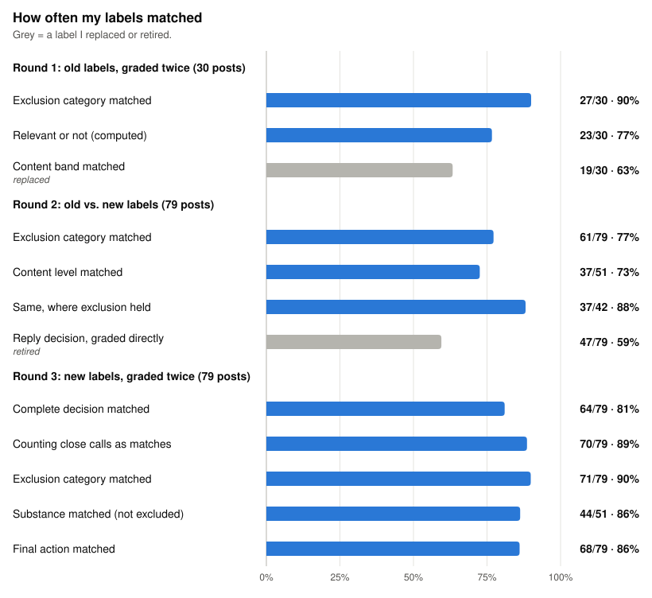

# Validate the schema, not just the model

Scout finds social posts about AI agents and drafts replies to them. Before it drafts
anything, it scores each post for reply relevance: whether the post is
worth replying to. That score decides whether Scout responds, flags the post for review, or
drops it. To measure how well it makes that call, I need a set of correct answers, and I
wrote those answers myself. The labels on this page are my attempts to pin down what reply
relevance means.

I didn't know the right labels up front. Before scoring the model, I tested my labels and my
own consistency as a grader.

## What I did

I took 79 real posts from Scout's production feed and graded them over three rounds. Each
round tested the labels, and what it found shaped the next one.

1. **Old labels, graded twice.** I graded 30 of the posts with my first label set, then
   graded them again later, unmarked and in a different order among all 79.
2. **Old vs. new labels.** I redesigned the labels and regraded all 79, without seeing
   Scout's answers. This round measures the effect of the redesign, mixed with any drift in
   my own judgment. The old and new labels don't line up one-to-one, so only some answers
   compare directly.
3. **New labels, graded twice.** I graded all 79 again with the same new labels, so the only
   thing that could change was me. My bar was 72 of 79 matching decisions (91%).

## Results

| Round | What matched | Matched | % |
| --- | --- | ---: | ---: |
| 1 | Exclusion category | 27/30 | 90% |
| 1 | Relevant or not (computed from the labels) | 23/30 | 77% |
| 1 | Content band (replaced) | 19/30 | 63% |
| 2 | Exclusion category | 61/79 | 77% |
| 2 | Content level | 37/51 | 73% |
| 2 | Content level, where exclusion held | 37/42 | 88% |
| 2 | Reply decision, graded directly (retired) | 47/79 | 59% |
| 3 | Complete decision (my bar: 72/79) | 64/79 | 81% |
| 3 | Counting close calls as matches | 70/79 | 89% |
| 3 | Exclusion category | 71/79 | 90% |
| 3 | Substance (not excluded) | 44/51 | 86% |
| 3 | Final action | 68/79 | 86% |

**I still didn't agree with myself enough.** In round 3, 64 of 79 decisions matched (81%),
short of my 72 bar. 15 decisions changed, and 11 of those changed what Scout would actually
do with the post. The strict 64 is the result. For context, six of the changes were substance
calls where my new note named my earlier answer as the close runner-up. Counting those six as
matches gives 70 of 79 (89%), still two short of the bar.

## The disagreements were the useful part

Reading the disagreements showed why each label was unstable and what to change.

**The content band was asking two questions.** In round 1, exclusion held up (27 of 30),
but the content band matched only 19 of 30 (63%). Six of the 11 misses were two rungs
apart. Looking at the scale, the bottom rungs asked about the post's subject and the top
rungs asked how much substance the post itself had, so every grade forced two judgments
onto one rung.

**The reply decision was graded in one step.** I also graded respond, review or drop
directly, which meant weighing everything about a post at once. The new labels reach the
same decision in two steps: should this post be excluded, and if not, how much substance
does it carry? If the post alone has enough substance to reply to, it's in-post and gets a
response, even if it also has a link. If the substance sits behind a link, it goes to review,
because the link may or may not hold enough to reply to. Respond, review or drop is computed
from those answers in code.

Round 2 showed why the steps help. The direct decision matched the computed one only 59% of
the time, and of 12 posts that moved from review to respond, I had already marked 7 as
substantive the first time, so my direct call had disagreed with my own substance call. I
stopped grading the decision directly.

**Definitions drift while you grade.** 13 of the 18 changed exclusion calls in round 2
moved the same way, toward excluding. My working meaning of "substance" shifted too, from
"where does most of the information live?" to "is there enough here to write a real reply
without opening the link?" The comparison surfaced that drift, and the second reading is the
definition I kept.

**The notes explained some changes and not others.** On hard calls I wrote a short note,
often a split like "60/40, in the post vs. not enough." All seven substance changes in
round 3 had a note, and six of them named my earlier answer as the close runner-up. Those
notes show I considered both answers plausible. Exclusion changes were the opposite: seven
of eight had no note, including all four that changed the action. Those are the real
problem, and nothing I wrote down explains them.

An LLM read the notes for me and sorted each changed decision by whether a note explained it
and which answer the note named as runner-up. Keeping those notes let me use an LLM to analyze
distinctions that the class labels alone would have lost.

Grading by hand early is how I found out which labels were broken.

## What changed in how I grade

- Each label asks one question: exclusion first, then substance. Respond, review or drop is
  computed from them in code instead of graded directly, and the content band is gone.
- Model accuracy against these labels will be reported next to my 81% self-agreement,
  because my labels aren't yet a stable ground truth.

## Next steps

- **Fix exclusions first.** They account for every unexplained change that altered the
  action. Tighten the category definitions and require a note on every exclusion call.
- **Add a "need the thread" option.** On three posts, my notes said I couldn't judge
  without the surrounding conversation.
- **Retest** after those changes.
- **Bring in a second grader** on a sample. Retesting myself only shows whether I'm
  consistent.
- **Then score the model**, with the grader's agreement shown next to the result.
