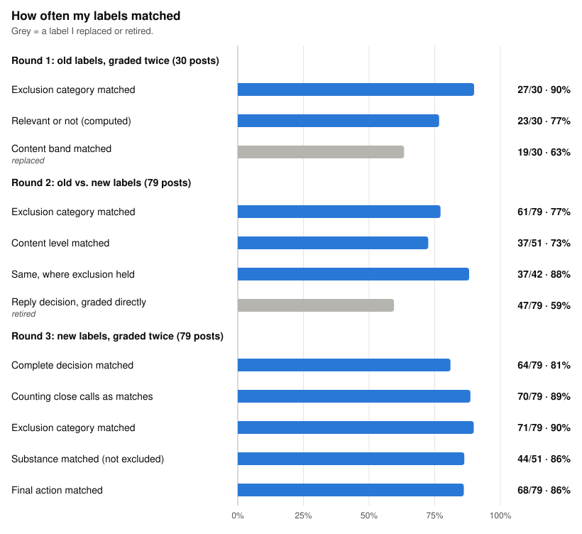

# Validate the schema, not just the model

Scout finds social posts about AI agents and drafts replies to them. Before it drafts
anything, it classifies each post for reply relevance: whether the post is worth replying to.
That classification decides whether Scout responds, flags the post for review, or drops it.
To measure how well it makes that call, I need a set of correct answers, and I wrote those
answers myself. The labels on this page are my attempts to pin down what reply relevance
means.

I didn't know the right labels up front. Before scoring the model, I tested my labels and my
own consistency as a grader. Then I used the revised rubric to compare classifiers on fresh
posts, refine a zero-shot classifier built with JEV, and integrate it into Scout.

*Updated September 29, 2026. The [supporting data](data/) includes the earlier label
comparisons and the new model experiments.*

## What I did

I took 79 real posts from Scout's production feed and graded them over three rounds. Each
round tested the labels, and what it found shaped the next one.

1. **Old labels, graded twice.** I graded 30 of the posts with my first label set, then
   graded them again later, unmarked and in a different order among all 79.
2. **Old vs. new labels.** I redesigned the labels and regraded all 79, without seeing
   Scout's answers. This round measures the effect of the redesign, mixed with any drift in
   my own judgment. The old and new labels don't line up one-to-one, so only some answers
   compare directly.
3. **New labels, graded twice.** I graded all 79 again with the same new labels, so the only
   thing that could change was me. My bar was 72 of 79 matching decisions (91%).

## Results from testing the labels

| Round | What matched | Matched | % |
| --- | --- | ---: | ---: |
| 1 | Exclusion category | 27/30 | 90% |
| 1 | Relevant or not (computed from the labels) | 23/30 | 77% |
| 1 | Content band (replaced) | 19/30 | 63% |
| 2 | Exclusion category | 61/79 | 77% |
| 2 | Content level | 37/51 | 73% |
| 2 | Content level, where exclusion held | 37/42 | 88% |
| 2 | Reply decision, graded directly (retired) | 47/79 | 59% |
| 3 | Complete decision (my bar: 72/79) | 64/79 | 81% |
| 3 | Counting close calls as matches | 70/79 | 89% |
| 3 | Exclusion category | 71/79 | 90% |
| 3 | Substance (not excluded) | 44/51 | 86% |
| 3 | Final action | 68/79 | 86% |

**I still didn't agree with myself enough.** In round 3, 64 of 79 decisions matched (81%),
short of my 72 bar. 15 decisions changed, and 11 of those changed what Scout would actually
do with the post. The strict 64 is the result. For context, six of the changes were substance
calls where my new note named my earlier answer as the close runner-up. Counting those six as
matches gives 70 of 79 (89%), still two short of the bar.

## The disagreements were the useful part

Reading the disagreements showed why each label was unstable and what to change.

**The content band was asking two questions.** In round 1, exclusion held up (27 of 30),
but the content band matched only 19 of 30 (63%). Six of the 11 misses were two rungs
apart. Looking at the scale, the bottom rungs asked about the post's subject and the top
rungs asked how much substance the post itself had, so every grade forced two judgments
onto one rung.

**The reply decision was graded in one step.** I also graded respond, review or drop
directly, which meant weighing everything about a post at once. The new labels reach the
same decision in two steps: should this post be excluded, and if not, how much substance
does it carry? If the post alone has enough substance to reply to, it's in-post and gets a
response, even if it also has a link. If the substance sits behind a link, it goes to review,
because the link may or may not hold enough to reply to. Respond, review or drop is computed
from those answers in code.

Round 2 showed why the steps help. The direct decision matched the computed one only 59% of
the time. Of 12 posts that moved from review to respond, I had already marked 7 as
substantive the first time. What I hadn't made explicit was that enough substance in the
post itself was sufficient to respond, even when it included a link. The new labels made
that rule explicit, and I stopped grading the decision directly.

**Definitions drift while you grade.** 13 of the 18 changed exclusion calls in round 2
moved the same way, toward excluding. My working meaning of "substance" shifted too, from
"where does most of the information live?" to "is there enough here to write a real reply
without opening the link?" The comparison surfaced that drift, and the second reading is the
definition I kept.

**The notes explained some changes and not others.** On hard calls I wrote a short note,
often a split like "60/40, in the post vs. not enough." All seven substance changes in
round 3 had a note, and six of them named my earlier answer as the close runner-up. Those
notes show I considered both answers plausible. Exclusion changes were the opposite: seven
of eight had no note, including all four that changed the action. Those are the real
problem, and nothing I wrote down explains them.

An LLM read the notes for me and sorted each changed decision by whether a note explained it
and which answer the note named as runner-up. Keeping those notes let me use an LLM to analyze
distinctions that the class labels alone would have lost.

Grading by hand early is how I found out which labels were broken.

## What changed in how I grade

- Each label asks one question: exclusion first, then substance. Respond, review or drop is
  computed from them in code instead of graded directly, and the content band is gone.
- My repeat agreement was 81% for the complete decision and 86% for the final action.
  My labels aren't yet a stable ground truth. Those measurements used earlier posts and
  definitions; they provide context for the model experiments, not a performance ceiling.

## Turning the rubric into a classifier

The next experiment made the questions executable. JEV scores each feature: exclusion
categories, whether the post needs its thread, whether there is enough in the post to answer,
whether it concerns agent work, and whether it points to useful material elsewhere. It
scores all the features; code then combines them into a decision.

The decision checks exclusions first, then missing thread context, then whether the post
is answerable and about agent work, then whether it points elsewhere. The feature thresholds
are 0.5. If a feature consulted along that path is within 0.1 of its threshold, the final
action is review. These thresholds were fixed, not fitted to the labels.

This evaluates **JEV's feature scores and the decision rule together**. It also makes the
reason for a decision inspectable: an exclusion, missing context, enough substance in the
post, a pointer, or a close call.

## Comparing the models on fresh posts

I graded two more batches blind, with production decisions and model answers hidden. Each
selected the 65 most recent agent-ops posts and 35 most recent agent-evals posts outside the
earlier grading rounds. Round 4 selected 100 posts but had 10 repeated texts, leaving 90
scored cases. Round 5 filtered repeats during selection and scored all 100. The form included
"need the thread"; no submitted label in either batch selected it.

I compared Scout's production relevance prompt with JEV and a Gemini 2.5 Flash arm answering
the feature questions under the same decision rule. Production also used Gemini 2.5 Flash,
but with its existing relevance prompt and cutoff. It had no review state, so the shared
comparison is **keep or drop**: respond and review both count as keep. Exact action agreement
also distinguishes respond from review.

| Round | Classifier | Keep or drop agreement | Exact action agreement |
| --- | --- | ---: | ---: |
| 4 | Production | 51/90 (57%) | — |
| 4 | Gemini, v4 features | 62/90 (69%) | 51/90 (57%) |
| 4 | JEV, v4 features | 57/90 (63%) | 52/90 (58%) |
| 4 | JEV, v5 features, after iteration | 68/90 (76%) | 62/90 (69%) |
| 5 | Production | 64/100 (64%) | — |
| 5 | Gemini, v4 features | 58/100 (58%) | 53/100 (53%) |
| 5 | Gemini, v5 features | 58/100 (58%) | 52/100 (52%) |
| 5 | JEV, v4 features | 59/100 (59%) | 55/100 (55%) |
| 5 | JEV, v5 features | 77/100 (77%) | 71/100 (71%) |

JEV v4 did not win the first comparison: Gemini's feature arm had better keep/drop agreement
in round 4. Inspecting the misses led to two changes for v5: widen the hype exclusion to
include promotion, and make the pointer question distinguish useful agent material from
news or product pages. The v5 result on round 4 is development on cases I had already seen.

**Round 5 tested that revision on fresh posts.** V5 was frozen before the batch was seen,
and the human form used the revised exclusion definition. JEV v5 agreed on keep/drop for
77 of 100 posts, versus production's 64: a 13 percentage point improvement on the same
cases. Exact action agreement was 71%. The gain was present in both projects: keep/drop
agreement was 51/65 (78%) for agent-ops and 26/35 (74%) for agent-evals.

The errors still mattered. JEV v5 dropped 3 of the 47 posts I wanted kept and kept 20 of the
53 I wanted dropped. This is agreement with one reviewer's labels on two recent batches,
not proof that the labels are correct or that the result generalizes to every Scout project.

[Aggregate results](data/results.json) · [Decisions as CSV](data/decisions.csv) ·
[Round 4 feature scores](data/round4.json) · [Round 5 feature scores](data/round5.json)

## The benchmark experiment and v6

Some remaining misses were posts that reported benchmark scores without enough method,
failure analysis or practical detail to reply to. I tested a narrow exclusion for those
score reports, alongside a broader benchmark exclusion, on the 190 scored posts from
rounds 4 and 5. The narrow version became the additional feature in v6.

Replaying the stored v5 answers with that tested feature added gives:

| Batch | Keep or drop, v5 → benchmark replay | Exact action, v5 → benchmark replay |
| --- | ---: | ---: |
| Round 4, 90 posts | 68/90 → 70/90 (78%) | 62/90 → 64/90 (71%) |
| Round 5, 100 posts | 77/100 → 78/100 (78%) | 71/100 → 72/100 (72%) |

The narrow feature scored at least 0.5 on six posts, all of which I had labelled drop.
Adding it corrected three final actions: two reviews in round 4 and one response in round 5
became drops. It introduced **no additional drops of posts I wanted kept**. The existing
four misses of kept posts in round 4 and three in round 5 remained; the classifier did not
have perfect recall.

This was a refinement after inspecting the labels, not a fresh validation batch. The numbers
above combine recorded v5 feature scores with the separately tested benchmark score. The
final v6 catalogue adds one clarification to that question: a link to the source does not
change a score-only exclusion. That final wording was not separately measured in these
stored answers. The [supporting data](data/) identifies the replay explicitly so it can be
distinguished from the original model runs.

## Bringing v6 into Scout

Scout now has the v6 classifier integrated for agent-ops and agent-evals. The classifier is
called zero-shot in Scout; JEV is the provider. Its recorded action controls what happens
next: respond proceeds to drafting and critique, review waits for human inspection without
a draft, and drop stops. A human can resolve a review as respond or drop; respond creates a
draft through the existing promotion flow.

Scout records the feature probabilities and decision path, along with the classifier and
action. Human decisions are recorded separately from model decisions. Other projects retain
the LLM relevance path until they have their own graded evidence.

The integration also supports randomly holding posts at decision time, including drops,
for blind grading in Assay. That can measure missed opportunities as well as unwanted
responses. Sampling is configurable and defaults to off; building the mechanism is separate
from collecting a new production result. The figures here are the offline experiments.

## What comes next

- Measure v6 on fresh production holdouts, with the catalogue frozen before grading.
- Retest the current human rubric and bring in a second grader on a sample.
- Inspect the remaining false drops and unwanted keeps, preserving notes on close calls.

The useful progression was from testing my labels, to making the questions explicit, to
testing the resulting decisions on fresh posts, and then carrying that same decision rule
into Scout.

## Supporting data

The [public data bundle](data/) contains the earlier label comparisons, structured human
labels and model feature scores for the new rounds, per-post decisions, aggregate results,
source hashes, and a verification command. It supports the tables without publishing post
text, author identities, original URLs, private notes or the private feature catalogue.
